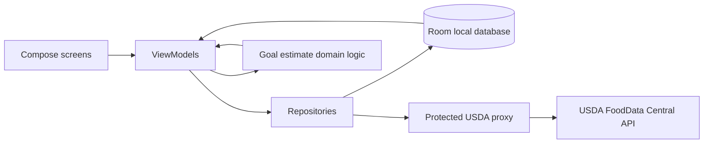

# Calorie & Goal Tracker — Android App Plan

**Version:** 0.001  
**Status:** Planning draft  
**Prepared:** 2026-09-26  
**Purpose:** Define a fast, practical first release of an Android app for logging food energy and estimating a safe, sustainable path toward a user-selected weight goal.

## 1. Product summary

A private, offline-friendly Android app that lets one person:

- Search a current food-composition source, choose the correct food and serving, and log calories eaten.
- See today's intake, a chosen daily budget, and recent history.
- Enter a starting weight, goal weight, and optional target date.
- Receive an **estimate**, not a promise, of the daily energy gap and physical-activity contribution that could support the goal.
- Understand where food values came from and when they were retrieved.

The app is a wellness tracker, not a diagnostic or treatment tool. Keep the first release single-user and local-first; account sync, barcode scanning, wearables, and AI meal recognition are later options.

## 2. Recommended quick-start stack

| Area | Choice | Why |
|---|---|---|
| Android language and build | Kotlin, Android Studio, Gradle Kotlin DSL | Native Android workflow and strong Jetpack support. |
| UI | Jetpack Compose + Material 3 | Android's recommended modern UI toolkit; fast screen iteration and previews. |
| App design | Single activity, ViewModels, repositories, unidirectional data flow | Small but testable separation between screens, app logic, and data. |
| Local persistence | Room for meals, food snapshots, profile and weight history; DataStore for preferences | Logging works offline and survives app restarts. |
| Async/network | Kotlin coroutines and Flow; Retrofit + Kotlin serialization (or the Android team's current recommended HTTP client) | Straightforward API calls and reactive local data. |
| Food data | USDA FoodData Central API, with local caching | Public-domain nutrient records and searchable foods; see data freshness notes below. |
| API-key protection | Tiny serverless proxy (Firebase Cloud Functions or Google Cloud Run) holding the USDA key as a server secret | Do **not** ship the USDA API key inside the APK; client-side keys can be extracted. Restrict and rate-limit the proxy. |
| Tests | JUnit, coroutine test support, Room in-memory tests; Compose UI tests for core flows | Verify arithmetic, persistence and essential user journeys. |
| Source control | Git; add CI only after the first vertical slice works | Keeps the first setup small while preserving a clean history. |

**Build fast:** create a new native Kotlin/Compose project in Android Studio, use the current stable Android Studio/SDK and compatible library versions offered by its templates, and keep the initial code in one `app` module. Avoid a web wrapper, separate backend database, multi-module setup, and dependency injection framework until there is a demonstrated need. A thin USDA proxy is the only planned server component because the USDA key must not be public.

## 3. MVP scope

### Required screens

1. **Onboarding / profile** — units, age, height, current weight, goal weight, usual activity, and optional target date. Explain which values are optional and how they are used.
2. **Today** — total logged calories, remaining-to-budget indicator, meals grouped by time, and a clear add-food action.
3. **Food search and serving** — search results with source/type, energy per stated serving or 100 g, serving quantity/unit, and a confirmation step before logging.
4. **Add/edit log entry** — meal label, amount, date/time, calories, and source attribution. Allow manual/custom food entry and corrections.
5. **Progress / estimate** — weight trend, goal progress, estimated intake/energy range, and a plain-language activity estimate with assumptions.
6. **Settings / data** — edit profile, export or delete local data, and view data-source and safety notes.

### MVP acceptance criteria

- A user can search an online food catalog, select an item, adjust grams/servings, log it, edit/delete it, and see the daily total update.
- Search responses identify the food record and source; the app saves a snapshot of the selected nutrient value and retrieval date so old logs do not silently change when a catalog entry changes.
- Food logs and profile data remain available offline. Food search clearly reports when it needs a network connection.
- The estimate displays its assumptions, distinguishes ordinary daily activity from **additional** planned exercise, and does not label estimates as measured or guaranteed burn.
- Users can correct imported data and set goals without a target date.

## 4. Food calorie data: freshness and correctness

### Source of truth

Use the official [USDA FoodData Central API](https://fdc.nal.usda.gov/api-guide.html), not a copied calorie table or scraped search-engine snippets. Its API supports food search and food-detail lookups. Request an API key through USDA and keep it only on the server-side proxy; the official API guide warns that exposed keys can be deactivated and documents request limits.

Choose and display the most relevant FoodData Central data type:

- **Foundation Foods:** analytically derived commodity and minimally processed food values; USDA documents releases in April and October.
- **Branded Foods:** label information for branded products; USDA documents monthly updates. Treat label values as label-reported, not lab-measured.
- **FNDDS:** foods and portions from dietary surveys; updated in line with the biennial survey release.
- **SR Legacy:** historical reference data whose final release was April 2018; do not describe it as freshly updated.

Update schedules are for datasets, not a guarantee that every individual record has just been re-verified. Label results with the record/data type and source; preserve the retrieved value and date on each food log. Let a user refresh or correct an item rather than rewriting past logs automatically.

### Calculation and UX rules

- Prefer the data provider's energy value and stated serving/portion. When converting a value expressed per 100 g, calculate the selected portion proportionally: `portion_kcal = kcal_per_100g × grams / 100`.
- Keep units explicit; distinguish grams, millilitres, package serving and household measures. Never assume millilitres equal grams for every food.
- Show calorie values as estimates and retain sensible precision internally; avoid implying that product labels or generic foods are exact.
- For user-created recipes, add each ingredient amount and calculate a recipe total; divide by entered servings only when the user supplies the serving count.
- If multiple food matches are plausible, ask the user to choose. Do not silently choose the first result.
- Cache search/detail results for speed and offline access, while indicating that a cached record may not be current.
- Cite USDA FoodData Central in the app's source/about view. USDA states its data are public domain (CC0 1.0) and requests attribution where possible.

## 5. Goal and activity estimate

The phrase “calories to burn” is ambiguous. The app should make clear that **total daily energy expenditure** includes resting metabolism and ordinary movement; it must not add a wearable's total calories on top of an activity-adjusted maintenance estimate.

### First-release approach

1. Collect current weight, height, age, activity level, goal weight, and optional planned food intake/date. Explain the assumptions and allow editing.
2. Estimate maintenance energy using a documented adult estimation method and present a range, not a precise measurement. Better still, allow later calibration against several weeks of user-entered intake and smoothed weight trend.
3. For a desired goal pace, calculate the estimated daily energy gap needed. Show how planned intake contributes to that gap, then show only the **additional** activity contribution remaining relative to the user's usual baseline. If their planned intake already meets the chosen gap, do not prescribe extra exercise.
4. Display a weekly trend and revise estimates gradually using observed progress; explain that biology, measurement error, food logging, and activity estimates cause deviations.
5. If a requested goal or date implies an aggressive or unsupported pace, do not turn it into an exercise prescription. Flag the estimate and invite a safer goal or professional guidance.

Do not present a fixed “calories per kilogram” rule as a precise forecast: weight change is dynamic and the simple static conversion becomes inaccurate over time. For a production-quality weight-change forecast, use or validate against the [NIDDK Body Weight Planner](https://www.niddk.nih.gov/bwp) methodology rather than promising a date from a linear calculation. NIDDK says its planner is for adults 18+ and not for younger people or pregnant/breastfeeding women; the app should suppress weight-loss prescriptions for those groups and direct users to a qualified health professional. The [CDC guidance](https://www.cdc.gov/healthy-weight-growth/losing-weight/index.html) emphasizes gradual, sustainable progress and consultation with a health professional where appropriate.

This plan does not set a universal minimum calorie intake or prescribe a specific exercise program. Any thresholds require review by a qualified nutrition/health professional and localization to the intended market.

## 6. Proposed project layout

The current repository is a small Python project. Keep it intact and add the Android app in a separate `android/` directory when implementation starts:

```text
Calories-Tracker/
├── main.py                         # Existing Python entry point; leave unchanged initially
├── README.md
├── ANDROID_APP_PLAN_v0.001.md
└── android/
    ├── settings.gradle.kts
    ├── build.gradle.kts
    ├── gradle/libs.versions.toml
    └── app/
        ├── build.gradle.kts
        └── src/
            ├── main/
            │   ├── AndroidManifest.xml
            │   └── java/<package>/calorietracker/
            │       ├── app/             # Activity, navigation, app shell
            │       ├── data/
            │       │   ├── local/        # Room entities, DAOs, database
            │       │   ├── remote/       # USDA proxy client and DTOs
            │       │   └── repository/   # Food, diary, profile repositories
            │       ├── domain/           # Goal/energy calculations and use cases
            │       ├── ui/
            │       │   ├── today/
            │       │   ├── foodsearch/
            │       │   ├── progress/
            │       │   └── settings/
            │       └── core/             # Units, dates, validation, formatting
            ├── test/                     # Unit and data-layer tests
            └── androidTest/              # Compose and device tests
```

Add the separate proxy source/deployment configuration only when implementing USDA calls; never commit its secret. Keep the app package layout intentionally simple until feature count justifies modules.

## 7. Core data model (initial draft)

- **Profile:** age/date of birth (prefer age if full date is unnecessary), height, current/goal weight, units, activity assumptions, optional safety flags and preferences.
- **FoodRecord:** USDA `fdcId`, description, data type, source URL/attribution, nutrient value, nutrient basis/portion, retrieval timestamp, and optional cached payload version.
- **FoodLogEntry:** stable ID, food reference/snapshot, quantity, unit/grams where known, calculated calories, meal category, timestamp, and optional notes.
- **WeightEntry:** stable ID, measured value/unit, date, optional note.
- **GoalEstimate:** calculated range, calculation method/version, inputs/assumptions, generated timestamp, and warning state. Recompute when relevant inputs change; preserve history only if useful to the user.

Use explicit unit conversion helpers, UTC timestamps with local display, and database migrations as the schema evolves. Avoid storing more sensitive information than the features need.

## 8. Data flow



Room is the source of truth for diary and profile data. Remote food results are cached locally, but network lookup and diary logging remain separate operations so a temporary API outage does not block manual logging.

## 9. Build sequence and tools

### Phase 0 — setup (half day)

- Install/update Android Studio and SDK; create Kotlin + Compose + Material 3 project; run its starter screen on an emulator or Android device.
- Create the `android/` project beside the existing Python files; initialize Git if needed; commit the generated baseline.

### Phase 1 — usable offline diary (1–2 days)

- Build Today, add/edit food manually, meal grouping and daily totals.
- Add Room entities/DAOs and basic tests; persist profile/preferences.
- Add unit-aware serving and calorie calculations with tests.

### Phase 2 — internet food search (1–2 days, plus proxy deployment)

- Obtain a USDA key; create a minimal protected proxy with secret configuration, input validation, basic abuse controls and response shaping.
- Implement search/detail lookup, loading/error/no-network states, source display and Room caching.
- Add attribution, stale-cache indicator and record snapshots.

### Phase 3 — goal estimates and polish (1–2 days)

- Add setup/profile, progress chart/trend, estimation assumptions and guardrails.
- Test calculation edge cases, accessibility, unit switching, timezone boundaries and offline behavior.
- Install a debug build on a physical phone and use it for several days before changing estimates based on real usage.

Time ranges are rough solo-developer estimates and exclude store publishing, design review, clinical review and backend account setup.

### Suggested developer tools

- Android Studio (Compose previews, emulator, Logcat, profiler) and current stable Android SDK.
- Gradle Kotlin DSL with a version catalog for dependency versions.
- Git and GitHub for source history; GitHub Actions later for build/test automation.
- USDA FoodData Central API key and a serverless runtime that stores it as a secret.
- Optional later: Health Connect for user-authorized activity data; do not make it an MVP dependency. Read only the specific data types needed and explain permissions.

## 10. Privacy, security and quality checks

- Keep all daily logs on-device in the MVP. Ask for no account and upload no diary/profile data unless a future feature explicitly needs it.
- Do not put API keys, signing keys, or secrets in source control, app resources, or the APK. Protect the proxy against excessive requests and validate parameters.
- Request permissions only at the point a feature needs them. Health Connect integration is opt-in and deferred.
- Include local export/delete controls and a concise privacy notice before any cloud sync is introduced.
- Test serving conversions, zero/negative/very large amounts, malformed API results, duplicate logs, date rollover, offline use and database migrations.
- Keep medical/wellness disclaimers visible at the point of the estimate, not hidden only in About.

## 11. Risks and decisions to revisit

| Risk / open decision | Initial handling |
|---|---|
| USDA API key embedded in a mobile app | Prevent with a server-side proxy; configure secret storage and rate limits. |
| Food record differs from the user's exact product or preparation | Show source/type/serving and let the user choose, edit or create a custom food. |
| Stale or changed nutrient values alter historical totals | Snapshot the chosen value and date in each log; never silently rewrite past entries. |
| Estimated exercise energy is unreliable | Label as a range, separate baseline from additional activity, and do not claim precise burn. |
| Goal could encourage unsafe restriction | Use conservative guardrails, suppress unsupported recommendations, and point to professional advice. |
| Android integration needs change | Recheck current Android documentation and stable dependency versions when coding; optional integrations stay out of MVP. |
| Intended market and units are unknown | Start with metric and imperial unit support; choose localization only after confirming target users. |

## 12. Research references (checked 2026-09-26)

- USDA FoodData Central API guide — endpoints, API key responsibility, rate limits and attribution: https://fdc.nal.usda.gov/api-guide.html
- USDA FoodData Central data-type documentation — data sources and update cadence: https://fdc.nal.usda.gov/data-documentation
- Android Jetpack Compose — modern native UI toolkit: https://developer.android.com/develop/ui/compose
- Android app architecture — layered design, repositories, UDF and offline data: https://developer.android.com/topic/architecture
- Android Room — structured local persistence: https://developer.android.com/training/data-storage/room
- NIDDK Body Weight Planner — adult-focused personalized weight-change planning and limitations: https://www.niddk.nih.gov/bwp
- CDC steps for losing weight — gradual lifestyle-based progress and professional guidance: https://www.cdc.gov/healthy-weight-growth/losing-weight/index.html
- Android Health Connect — optional user-authorized health-data integration: https://developer.android.com/health-and-fitness/health-connect

**Research note:** FoodData Central was selected because its official API and documented dataset update schedules make food-value provenance inspectable. “Latest” should mean the current available record from the selected USDA data type at lookup time—not a claim that every food has been recently reanalyzed. Recheck the linked product documentation, data availability, service terms and stable Android versions immediately before implementation.
