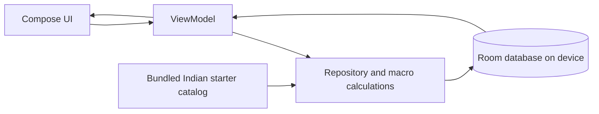

# Calorie & Goal Tracker — Android App Plan

**Version:** 0.002  
**Status:** Revised MVP plan; offline-first  
**Prepared:** 2026-09-26  
**Supersedes:** [ANDROID_APP_PLAN_v0.001.md](ANDROID_APP_PLAN_v0.001.md)  
**Change summary:** Version 1 is now designed to work completely offline. Foods and user edits are stored on-device; the first packaged catalog focuses on commonly eaten Indian foods, with custom foods and macros editable by the user. No network, online food search, account, API key, or cloud service is required by v1.

## 1. Product goal and explicit scope

Build a simple Android app to record food intake and provide a cautious estimate of energy balance toward a user-entered goal. Users can browse a food catalog already installed with the app, choose a gram amount, log it, and edit calories, protein, carbohydrates, and fat for any catalog food. Their food edits, logs and profile stay on their device.

**“Offline food database” means the v1 starter catalog plus foods the user creates, all persisted locally. It cannot realistically mean every food, recipe, brand, restaurant dish, and regional variation in existence.** Recipe and portion variation is substantial, especially for home-cooked Indian meals. The app must state that the starter entries are generic estimates, let people adjust values to match their recipe/label, and never imply that a generic dish is exact. An internet connection is not needed to use v1.

### Version 1 includes

- Offline search/filter over a bundled starter list featuring Indian staples and dishes.
- Create, edit and locally save foods, including energy and macros per 100 g.
- Log a chosen amount in grams; calculate and save energy, protein, carbohydrate and fat for that meal.
- Today's totals, meal history, and edit/delete log entries.
- A simple profile/goal and informational estimate, shown with assumptions and safety limits.
- No network permission, food API, sync or account in v1.

### Later, not required for v1

Barcode lookup, cloud backup/sync, online catalog refresh, branded product import, recipe parsing, Health Connect integration, AI/photo recognition, and multi-user profiles. Keep those out of the first build to reduce cost and protect privacy.

## 2. Recommended technologies for a fast Android build

| Area | Recommendation | Reason |
|---|---|---|
| Native app | Kotlin, Android SDK, Gradle | Native Android application that can be compiled into an APK. |
| UI | Jetpack Compose + Material 3 | Compose is Android's recommended modern UI toolkit and supports rapid screen iteration. |
| App shape | One Activity, a small ViewModel and repository, one app module | Enough separation to test calculations and storage without early modularization. |
| Local database | Room over SQLite | Stores the bundled and custom food catalog, food diary, and profile persistently while offline. Room is the local source of truth. |
| First-run catalog | A versioned, bundled starter list inserted into Room on first launch | Seeds the database without an internet connection; later edits live in Room and are not overwritten on app launch. |
| Preferences | DataStore only if/when user settings require it | Avoid adding a second store until needed. |
| Tests | JUnit + Room in-memory tests; Compose UI tests for key flows | Check macro math, editing and offline persistence. |
| Editor/runtime | VS Code in GitHub Codespaces, JDK, Gradle and Android command-line SDK in the Codespace | Android Studio is optional; the Android toolchain still must exist in the remote Codespace container. |

Use a current stable Android Studio/template and matching stable Android Gradle Plugin, Kotlin, Room, Compose and SDK versions when initializing or upgrading. Do not copy old dependency versions from a tutorial without checking compatibility. Keep the application self-contained for v1: no backend and no food API.

**Toolchain snapshot checked 2026-09-26:** AGP 9.4.0, Gradle 9.6 or newer, Kotlin 2.4.20, Compose BOM 2026.09.00, Room 2.8.5, compile SDK 37.2, target SDK 36, build tools 36.0.0, and JDK 17 or newer. These versions are pinned in the starter's version catalog; recheck the official compatibility notes when changing any one of them.

## 3. Food catalog and macros

### Local food record

Each food item has:

- Unique local ID, name, optional regional/alternate names and category.
- Serving basis fixed to **per 100 g** for this first implementation, to make scaling consistent.
- Energy (kcal), protein (g), carbohydrates (g), fat (g); optional fiber can be added later.
- A short source/quality note such as `Starter estimate — generic recipe; edit to match your preparation` or `User entered`.
- Created/updated timestamps and whether it came from the bundled starter set or was added by the user.

All nutrient inputs must be non-negative. A warning should explain that calorie and macros may not reconcile perfectly due to label rounding, cooking changes and fiber conventions. The user is allowed to edit the bundled items. A local edit updates the food for future logs; existing diary rows keep a snapshot of their name and calculated nutrients so historical records do not silently change.

### Indian starter catalog

Include common options across staple grains, pulses, dairy, vegetables, snacks and meals. Seeded dish values are **generic illustrative estimates per 100 g**, because recipe oil, water, ingredients and serving size change the nutrition. Include clear variations rather than pretending one value describes every dish, for example plain rice vs. biryani, plain roti vs. ghee-brushed roti, plain dosa vs. masala dosa, and unsweetened vs. sweetened drinks. Initial local entries include examples such as:

- Rice: cooked white rice, cooked brown rice, vegetable pulao, chicken biryani, vegetable biryani.
- Breads/breakfast: whole-wheat roti/chapati, paratha, poha, upma, idli, plain dosa, masala dosa, besan chilla.
- Pulses/vegetarian dishes: dal tadka, sambar, rajma, chana masala, palak paneer, paneer curry, aloo gobi, mixed vegetable sabzi.
- Other common foods: plain curd/dahi, paneer, boiled egg, chicken curry, tandoori chicken, banana, mango, chai with milk, and plain milk.

This starter set is intentionally representative, not exhaustive. Let users add regional foods and their own recipes. Do not market seeded values as laboratory-verified or as the latest values. In a later data-reviewed release, replace or supplement them with an authorized/appropriately attributed Indian reference dataset (for example, ICMR-NIN's Indian Food Composition Tables) and preserve its publication/version metadata. USDA FoodData Central is also an official public-domain source, but it is not a substitute for Indian recipe/brand coverage; importing its complete dataset would be unnecessarily large for the quick first release.

### Portion calculation

For a food quantity entered in grams:

$$\text{nutrient for portion} = \text{nutrient per 100 g} \times \frac{\text{portion grams}}{100}$$

Keep precision through calculations and round only for display (e.g. kcal to whole numbers, macros to one decimal). Use the same equation for each of energy, protein, carbohydrate and fat. Do not infer grams from a “cup” or “piece” in v1; use a gram quantity and optionally show a user-entered typical serving as a convenience later.

## 4. Main screens and flows

1. **Today:** today's intake and macro totals, food log grouped by time/meal, and prominent Add food action.
2. **Foods:** local search and category filter, name plus per-100-g nutrient summary, Add custom food, Edit food.
3. **Log food:** enter grams, select meal/time, preview calculated nutrients, save.
4. **Food editor:** edit name and each of kcal/protein/carbohydrate/fat per 100 g; show source/estimate note.
5. **Progress / goal:** optional current and goal weight, recent weight entries, and an estimate with inputs and limits shown.
6. **Settings:** unit/locale preferences if implemented, export/delete local data, nutrition source/limitations, and privacy note.

### v1 acceptance criteria

- After install and first launch with the device in airplane mode, the app shows the Indian starter catalog and lets a user search it.
- Users can add a custom food or change all four values (kcal, protein, carbs, fat) of any existing food. Changes remain after force-stop/relaunch and do not depend on a network.
- A user can log a gram amount, see all four scaled nutrients, edit/delete a log and see daily totals recompute.
- A food edit affects later logs only; saved old logs retain the nutrition snapshot from when they were logged.
- The Goal screen performs only a clearly labeled static energy-gap calculation for adult weight-loss planning; it suppresses targets implying more than about 0.9 kg/week and does not convert the result into exercise calories.
- The app declares no `INTERNET` permission for v1.
- Empty search, invalid values, zero grams, very large quantities, and database migration paths are handled without crashing.

## 5. Goal and calorie-burn prediction

Keep this feature informational and conservative. “Calories to burn” is not a precise workout prescription: estimated maintenance includes resting needs and ordinary activity, while devices and exercise calculators can overestimate activity energy.

The initial coding foundation implements only an **educational static energy-gap estimate**, using the conventional rough approximation of 7,700 kcal per kg of requested weight loss divided by the requested number of days. It is not a dynamic weight forecast, maintenance-calorie estimate, or exercise-calorie prescription. The screen labels the arithmetic, warns that any energy gap may come from intake and activity together, and suppresses targets implying over about 0.9 kg/week. This simple calculation is not a guarantee of safety for an individual and should be replaced or clinically reviewed before public release. Do not stack total wearable calories on top of an activity-adjusted maintenance value. Never claim a certain date or exact exercise calories will cause a specific weight outcome.

Do not present weight-loss estimates as advice for users under 18, pregnant/breastfeeding users, or users with relevant medical concerns; the screen must direct them to a qualified clinician. Do not invent universal minimum intake limits. The [NIDDK Body Weight Planner](https://www.niddk.nih.gov/bwp) is an adult-only reference (not for younger people or pregnant/breastfeeding women) and is **not** embedded in this simple app. Follow [CDC gradual weight-management guidance](https://www.cdc.gov/healthy-weight-growth/losing-weight/index.html). A registered dietitian/clinical review should approve goal algorithms and safety copy before public distribution.

## 6. Suggested project layout

```text
Calories-Tracker/
├── main.py                              # Existing file; leave unchanged
├── README.md
├── ANDROID_APP_PLAN_v0.001.md           # Previous planning snapshot
├── ANDROID_APP_PLAN_v0.002.md           # Current offline-first plan
└── android/
    ├── settings.gradle.kts
    ├── build.gradle.kts
    ├── gradle/libs.versions.toml
    └── app/
        ├── build.gradle.kts
        └── src/main/
            ├── AndroidManifest.xml
            └── java/com/example/calorietracker/
                ├── MainActivity.kt
                ├── data/
                │   ├── FoodDatabase.kt
                │   ├── FoodRepository.kt
                │   └── StarterFoods.kt
                └── ui/
                    └── TrackerViewModel.kt
```

Start in a single app module. Extract screens/packages only as the app grows. Keep the starter catalog versioned in source control and use Room migrations if the schema changes after release.

## 7. Data model and data flow

- **Food:** ID, name, category, kcal/protein/carbs/fat per 100 g, source note, custom/bundled marker, updated time.
- **FoodLog:** ID, food ID, snapshot name, amount in grams, snapshot kcal/protein/carbs/fat totals, meal/time.
- **WeightEntry / Profile:** optional profile details and dated measurements, stored locally only if the goal feature is enabled.

Room is the single source of truth. The app ships with seed data; on first launch it inserts seed rows only if the food table is empty. Food edits and diary operations thereafter query/update Room. No remote service participates in the v1 flow.



## 8. Build and use entirely in Codespaces

**Yes. You can write and build the app using VS Code in GitHub Codespaces without installing Android Studio or the Android SDK on your personal computer.** Android development still requires a JDK, Gradle, Android SDK command-line tools, platform/build tools and an accepted SDK license somewhere; in this workflow those live in the Codespace container. This current Codespace has Java and Gradle available but does **not** have `ANDROID_HOME`/`ANDROID_SDK_ROOT` configured, so an Android APK cannot be built here until the Android command-line SDK/platform is installed/configured in the Codespace.

Suggested workflow:

1. Install/configure Android command-line tools and required SDK platform/build-tools in the Codespace (or use a Codespaces dev-container image that already includes them); set `ANDROID_HOME` and `PATH` for the container and accept SDK licenses there. These are remote-container changes, not local-computer installation.
2. Use VS Code for Kotlin/Gradle edits. Android Studio is optional, but its emulator and visual inspection tools are convenient if available.
3. Build with Gradle in the Codespace. Download the generated debug APK from the VS Code Explorer/Ports or a GitHub Actions artifact, then install it on a physical Android phone.
4. For interactive testing, use an Android emulator on a machine that supports it or connect an Android device over a supported ADB network workflow. Codespaces usually does not provide a hardware-accelerated Android emulator directly in the browser.
5. Signing a release build and publishing to Google Play are separate steps; keep release signing secrets out of the repository.

This repository already has Java 25 and Gradle, but does not currently have the Android SDK. Build configuration and SDK compatibility should be confirmed after the SDK is added; a Codespace can build the app without requiring local administrator permission.

## 9. Quick implementation milestones

1. **Offline data foundation:** Kotlin/Compose starter screen, Room schema, first-run seed insertion, basic search.
2. **Usable diary:** log grams, scale all four nutrients, daily totals, edit/delete entries.
3. **Local food editing:** custom-food form and editor for bundled/custom food values; persistence and history snapshots.
4. **Goal estimate:** safe, transparent calculations and disclaimer after reviewing formula and intended user population.
5. **Test and package:** airplane-mode acceptance checks, unit/Room tests, accessibility review, APK build in Codespaces and physical-device test.

Do not add online food sources, backend, accounts, telemetry, or permissions before there is a specific user need and privacy review.

## 10. Quality, privacy and safety checklist

- No internet permission, login, upload, analytics, advertising identifier or cloud backup in v1.
- Keep user-entered profile and all diary/database information on-device; make clear that uninstalling the app may remove local data.
- Offer export/delete before adding sync; do not add unnecessary health/profile fields.
- Identify the starter nutrition values as approximate, especially prepared dishes. Permit correction and retain the source/quality note.
- Use snapshot values for historic logs; a later food edit cannot mutate past diary totals.
- Unit test macro scaling and validation; database test seed-once behavior, edit persistence, query-by-day and migrations.
- Make the goal estimate non-clinical, transparent, and reviewed before public release.

## 11. Research references (checked 2026-09-26)

- Android Jetpack Compose: https://developer.android.com/develop/ui/compose
- Android Gradle Plugin release/compatibility notes: https://developer.android.com/build/releases/gradle-plugin
- Kotlin release history: https://kotlinlang.org/docs/releases.html
- Room release versions: https://developer.android.com/jetpack/androidx/releases/room
- Android app architecture: https://developer.android.com/topic/architecture
- Room local database: https://developer.android.com/training/data-storage/room
- ICMR-NIN Indian Food Composition Tables landing site: https://www.nin.res.in/ (use as a reference for a future properly reviewed/attributed Indian nutrient dataset; verify usage terms and edition before importing values)
- USDA FoodData Central API: https://fdc.nal.usda.gov/api-guide.html (potential later optional online refresh; not used by offline v1)
- NIDDK Body Weight Planner: https://www.niddk.nih.gov/bwp
- CDC healthy weight guidance: https://www.cdc.gov/healthy-weight-growth/losing-weight/index.html

**Nutrition-data limitation:** Recipe-level calories and macros cannot be made reliably exact from a generic dish name alone. The first app includes a useful editable Indian-food starter catalog, not an exhaustive or clinically verified national database. A vetted data release should document source, edition, measurement basis, licensing/attribution and uncertainty for every imported dataset.
